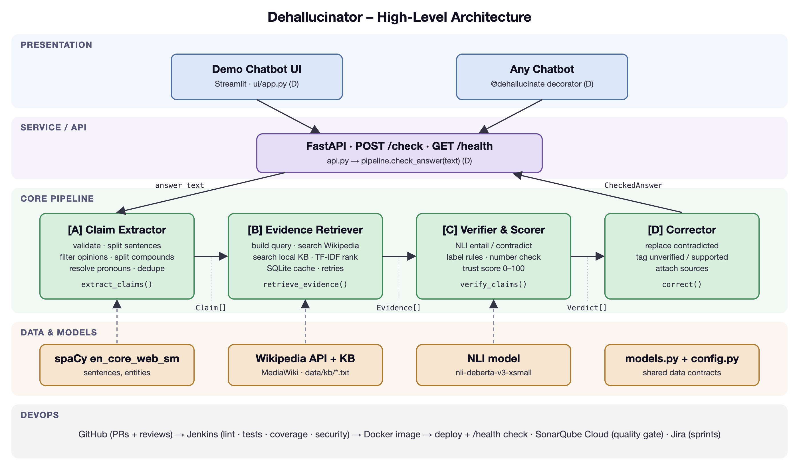

# Architecture Document

**Project 39: Dehallucination Add-On Module ("Dehallucinator")**

Sections:
1. High-Level Architecture Overview (Role A) – this file
2. Evidence Retriever component (Role B) – `architecture_evidence_retriever.md`
3. Verifier component (Role C) – to be added
4. API, UI and deployment (Role D) – to be added

---

## 1. High-Level Architecture Overview (Owner: Sai Nikitha Perumalla, Role A)

### 1.1 Architectural Style

Dehallucinator uses a **layered architecture** with a **pipe-and-filter** core. A request
passes through four independent stages in a fixed order, and each stage takes the previous
stage's output and adds to it.

- **Presentation:** the Streamlit demo chatbot and the `@dehallucinate` decorator for plugging into any chatbot.
- **Service:** a FastAPI REST API (`POST /check`, `GET /health`).
- **Core pipeline:** Claim Extractor → Evidence Retriever → Verifier & Scorer → Corrector.
- **Data and models:** spaCy language model, Wikipedia API, local knowledge base, NLI model, shared data models.

*Figure 1: High-level architecture of Dehallucinator*

### 1.2 Components

- **Claim Extractor (Role A):** splits the AI answer into standalone factual claims.
  Interface: `extract_claims(text) -> list[Claim]`.
- **Evidence Retriever (Role B):** finds supporting or contradicting text for each claim in
  Wikipedia and the local knowledge base. Interface: `retrieve_evidence(claims) -> list[Evidence]`.
- **Verifier & Scorer (Role C):** uses an NLI model to label each claim SUPPORTED,
  CONTRADICTED or NOT_ENOUGH_INFO, and computes a trust score.
  Interface: `verify_claims(claims, evidence) -> list[Verdict]`.
- **Corrector & Integrator (Role D):** rewrites the answer using the verdicts and exposes the
  whole pipeline through the API, UI and decorator. Interface: `check_answer(text) -> CheckedAnswer`.

### 1.3 Data Flow

1. A user or chatbot sends an AI-generated answer to `POST /check`.
2. The API validates the input and calls `check_answer()`.
3. The Claim Extractor returns a list of `Claim` objects (id, text, sentence_index).
4. The Evidence Retriever returns `Evidence` objects (claim_id, source, URL, snippet, relevance) for each claim.
5. The Verifier returns one `Verdict` per claim (label, confidence score, best evidence) and an overall trust score.
6. The Corrector builds the corrected answer: contradicted sentences are replaced with the
   evidence and its source, unverified sentences are flagged, and supported sentences are
   tagged with their source.
7. The API returns a `CheckedAnswer` (original text, corrected text, claims, verdicts, trust
   score) as JSON, and the UI displays it with colour-coded claims.

### 1.4 Key Design Decisions

- **Fixed data contracts:** all modules exchange the same Pydantic models defined in
  `models.py`, so the four modules could be developed in parallel and tested independently.
- **Single configuration file:** all thresholds and limits live in `config.py`, so behaviour
  can be tuned without changing code.
- **Offline fallback:** evidence comes from both Wikipedia and a local knowledge base, so the
  system still works if Wikipedia is unreachable.
- **Load-once models:** the spaCy and NLI models are loaded on first use and reused, keeping
  each request fast.
- **No paid services:** all models and data sources are free and run locally, so the system
  has no API keys or usage costs.

### 1.5 Deployment View

Code is hosted on GitHub, and every change goes through a reviewed pull request. Jenkins
builds each branch and runs linting, unit tests, coverage and security scans. On the main
branch it also builds a Docker image and deploys it, then checks `/health`. SonarQube Cloud
analyses every pull request for code quality. Sprints and tickets are tracked in Jira.
